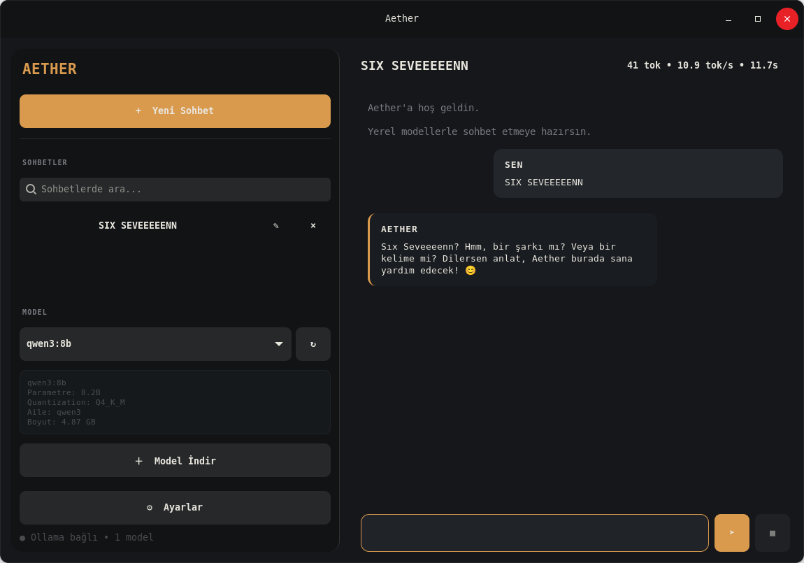
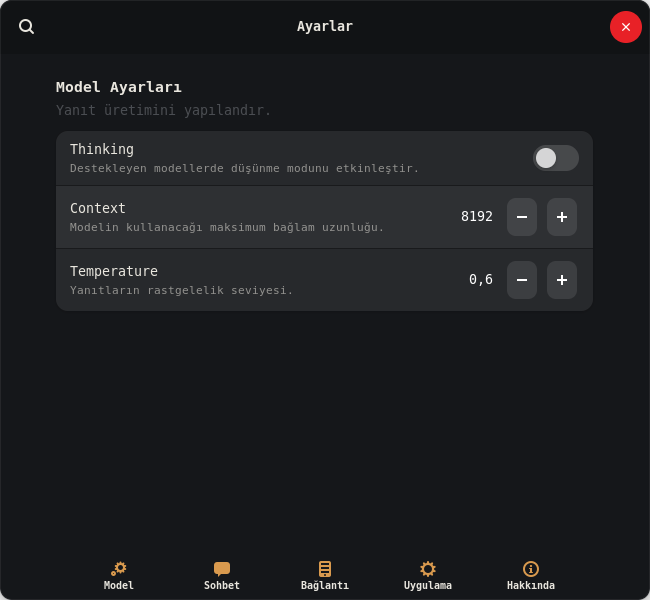
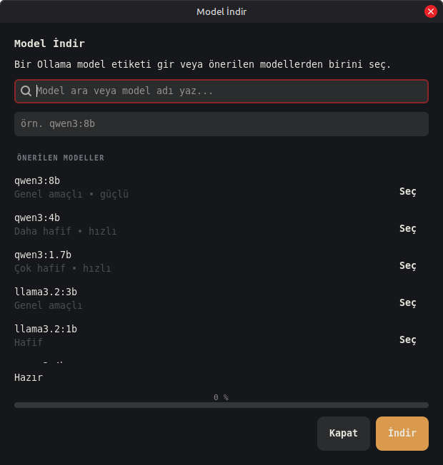

# Aether

**Ollama tabanlı, açık kaynaklı yerel yapay zeka masaüstü istemcisi.**


Aether, yerel veya uzak bir Ollama sunucusundaki modellerle GTK4/Libadwaita
arayüzünden sohbet etmenizi sağlar. Sohbet geçmişi ve ayarlar cihazda tutulur.

## 1.1 Foundation Update

- Streaming sohbet ve Thinking desteği
- Sohbet geçmişi, yeniden adlandırma ve mesaj içeriğinde arama
- Mesaj ve kod bloğu kopyalama
- Son Aether yanıtını yeniden üretme
- Sohbeti Markdown olarak dışa aktarma
- Model indirme, seçme ve güvenli biçimde silme
- Context / temperature / top-p / top-k / repeat penalty / çıktı token ayarları
- Özel system prompt desteği
- Token, süre ve tok/s istatistikleri
- Sohbet ve model silme için onay ekranları
- Daha zengin Markdown: başlık, liste, checkbox, quote, link, strike ve code block
- Sistem / açık / koyu tema
- XDG uyumlu ayar ve veri dizinleri ve 1.0 verilerinden otomatik geçiş
- Modüler `aether_app` uygulama katmanı
- Flatpak/AppStream altyapısı
- GitHub Actions ve temel unit testleri

## Gereksinimler

- Linux
- Python 3.10+
- GTK4 + Libadwaita
- Ollama

Ollama ayrı bir bileşendir. Aether 1.1 kurucusu artık Ollama servisine,
izinlerine veya modellerine otomatik olarak müdahale etmez.

## Debian / Ubuntu / Mint / Pardus kurulumu

```bash
curl -fLO https://raw.githubusercontent.com/MOzcelik14/Aether/main/install.sh
bash install.sh
```

Kurucu yalnızca Aether'ın sistem bağımlılıklarını ve Aether DEB paketini kurar.
Ollama eksikse sonunda kurulum bilgisini gösterir.

Kaldırmak için:

```bash
bash install.sh --uninstall
```

Sohbetler ve ayarlar kaldırma sırasında korunur.

## Geliştirme sürümünü denemek

```bash
git clone -b aether-1.1 https://github.com/MOzcelik14/Aether.git
cd Aether
python3 aether.py
```

Kurucuyu branch üzerinden test etmek için:

```bash
AETHER_REF=aether-1.1 ./install.sh
```

## Flatpak

Manifest `flatpak/com.murat.Aether.yml` altındadır ve GNOME 50 runtime'ını
kullanır.

```bash
flatpak-builder --user --install --force-clean build-dir flatpak/com.murat.Aether.yml
```

> Flathub gönderiminde kaynak branch'i sürüm etiketi ve sabit commit ile
> değiştirilmelidir.

## Kısayollar

- `Ctrl+N` — yeni sohbet
- `Ctrl+,` — ayarlar
- `Ctrl+K` — model seçimine odaklan

## Veriler

Aether 1.1 XDG dizinlerini kullanır:

- Ayarlar: `~/.config/aether/settings.json`
- Sohbet geçmişi: `~/.local/share/aether/history.db`

1.0'daki `local-ai` dizinleri bulunursa ilk açılışta otomatik olarak yeni
konumlara kopyalanır.

## Galeri

<p align="center">
  
</p>

<p align="center">
  
</p>

<p align="center">
  
</p>

## Katkı

Ayrıntılar için [CONTRIBUTING.md](CONTRIBUTING.md) dosyasına bakın.

## Lisans

Aether MIT lisansı ile dağıtılır.
